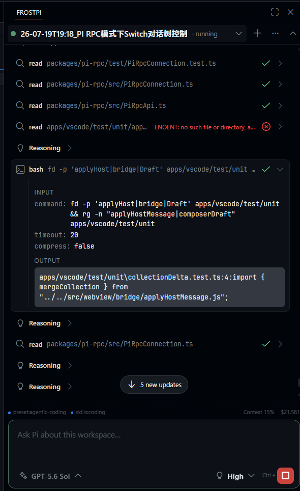
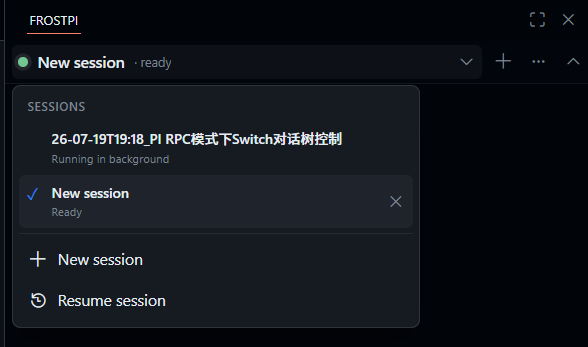
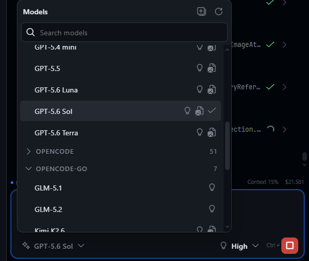
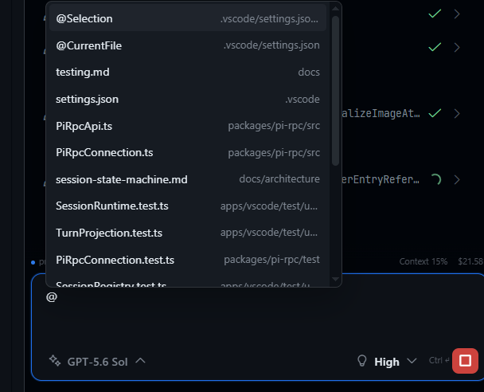
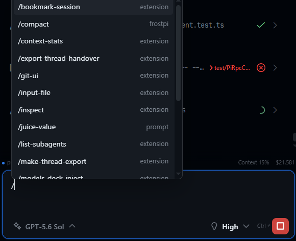
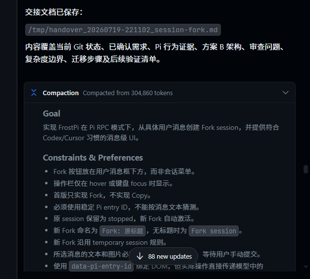
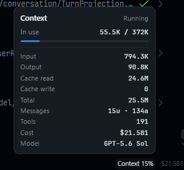

# FrostPi

<p align="center">
  <strong>A focused VS Code interface for Pi's coding agent</strong><br>
  Run Pi in its native RPC mode with live sessions, tool activity, model controls, and workspace-aware prompting.
</p>

<p align="center">
  
</p>

FrostPi brings Pi into a compact VS Code workspace view while preserving Pi's execution model: one independent `pi --mode rpc` process per FrostPi session, direct workspace access, and no file-tool proxy or hidden prompt-content injection.

## Why FrostPi

- **Keep work visible.** Stream reasoning, tool calls, command output, errors, and final responses in one ordered conversation.
- **Work in parallel.** Create, resume, switch, and run independent sessions without losing the current workspace context.
- **Use your workspace naturally.** Paste images, use `/` commands, reference `@Selection`, `@CurrentFile`, or workspace paths, and open files and Git-base diffs in native VS Code editors.
- **Choose with context.** Switch providers and models, then see only thinking levels supported by the active Pi model.
- **Stay oriented in long runs.** Pause-aware scrolling, unseen-update counts, context usage, compaction records, and session metrics keep large tasks manageable.

## See It In Action

<table>
  <tr>
    <td width="50%"><strong>Independent sessions</strong><br></td>
    <td width="50%"><strong>Model controls</strong><br></td>
  </tr>
  <tr>
    <td><strong>Workspace-aware prompting</strong><br></td>
    <td><strong>Slash commands</strong><br></td>
  </tr>
  <tr>
    <td><strong>Compaction for long sessions</strong><br></td>
    <td><strong>Context and cost detail</strong><br></td>
  </tr>
</table>

## Requirements

- VS Code 1.99 or newer.
- A trusted file-system workspace.
- Pi installed and configured in the same environment as the VS Code Extension Host.
- Pi available as `pi` on `PATH`, or configured through `frostpi.pi.executable`.

Remote SSH, WSL, and Dev Container workspaces run FrostPi and Pi in the remote workspace extension host. FrostPi does not bridge a local Pi process into a remote file system.

## Getting Started

1. Install FrostPi in VS Code.
2. Open a trusted workspace.
3. Open **FrostPi** from the Activity Bar. The view can be moved to the Secondary Sidebar.
4. Start a new session, resume an existing Pi session, or paste a prompt into the composer.
5. If Pi is not on `PATH`, run **FrostPi: Configure Pi Executable**.

## Core Workflows

### Prompt and workspace context

Paste PNG, JPEG, or WebP images directly into the composer. Use `/` for Pi extension commands, prompt templates, skills, and FrostPi-local actions. Use `@Selection`, `@CurrentFile`, or `@path/to/file` for workspace references; FrostPi inserts path and line text, while Pi decides whether to read the file.

### Models and sessions

Run multiple independent Pi sessions, switch providers and models, resume existing sessions, and select only the thinking levels exposed by the active model's Pi metadata. Session state remains visible while work continues in the background.

### Network and diagnostics

Configure inherited, VS Code, custom, or direct proxy modes for Pi subprocesses. Custom mode accepts `host:port`, `http(s)://...`, or `socks5://...`; credentials are stored in VS Code SecretStorage. FrostPi also provides context metrics, diagnostics export, strict LF-delimited JSONL transport, and schema-checked Webview messages.

## Privacy and Product Boundaries

FrostPi contains no telemetry or remote service of its own. Prompts and images are sent to the locally launched Pi process. Pi edits the workspace immediately, as it does in RPC mode; FrostPi's Diff action compares the current file with its Git `HEAD` version and is review, not pre-apply authorization.

FrostPi does not intercept Pi file writes, approve patches before application, emulate arbitrary custom TUI components, manage provider credentials, or persist conversation content outside Pi's own session storage. Multiple sessions can modify the same workspace concurrently; FrostPi displays their state but does not serialize or merge their changes.

See [`docs/privacy.md`](docs/privacy.md) and [`THIRD_PARTY_NOTICES.md`](THIRD_PARTY_NOTICES.md) for details.

## Development

```bash
pnpm install --frozen-lockfile
pnpm check
pnpm package:vsix
pnpm verify:vsix
pnpm package:zip
```

The workspace contains:

- `packages/pi-rpc`: Pi subprocess transport and typed RPC API.
- `apps/vscode`: extension host, stable Host-Webview contracts, and Svelte UI.
- `docs`: architecture, protocol, UI, testing, privacy, and release documentation.

Start with [`docs/index.md`](docs/index.md). Behavioral compatibility contracts live next to their modules as `*.SPEC.md` or `SPEC.md`.

## License

AGPL-3.0-only. FrostPi is an independent client and is not an official Pi distribution.
